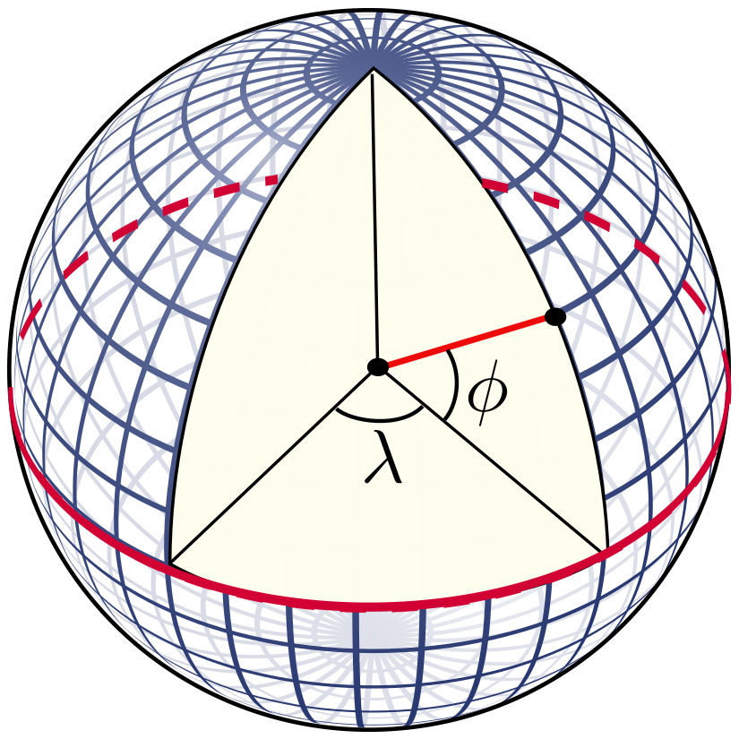

```@meta
CurrentModule = Pixell
```

# Maps and Pixels

## Rectangular Pixelizations

Pixell allows you to work with rectangular pixelizations, with an emphasis on equidistant cylindrical projections (ECP) like [plate carrée](https://pro.arcgis.com/en/pro-app/2.8/help/mapping/properties/plate-carree.htm). This pixelization is identified as `CAR` in [WCS](https://www.atnf.csiro.au/people/mcalabre/WCS/) coordinates. Invented in A.D. 100, CAR maps continue to be a useful and efficient way to map the Earth and Universe. 


**Figure 1**. *A CAR pixel would be one of these small rectangular patches between lines of fixed longitude and latitude. Note the singularities at the poles. CAR pixels are not the same size across the sky.*

One of the most useful aspects of CAR maps is that the representation of the map in computer memory is a simple 2D array. The indices of these pixels are related linearly to the angles on the sky. This package can plot CAR maps as this array, but it's important to note that showing the array in this way distorts both angles and areas on the sphere, since the sphere has curvature.

```@example intro
using Pixell, Plots # hide
shape, wcs = fullsky_geometry(10.0 * Pixell.degree)  # hide
m = Enmap(randn(shape), wcs)  # hide
plot(m)   # hide
```
**Figure 2**. *Each square is 10 degrees on this map of the full sky, now flattened to array form. This visualization distorts the map considerably, particularly at the poles.*

This flattened projection is a poor visualization of the sky for large sky areas, but is very good in the limit of small sky areas centered on the equator. This coincides with regions where the so-called "flat-sky approximation" holds, and one can perform fast fourier transforms instead of spherical harmonic transforms. Let's look at a smaller, high-resolution map centered on the equator:

```@example intro
using Pixell, Plots # hide
import Pixell: degree, arcminute  # hide
box = [4   -4;           # hide
       -2     2] * degree  # hide
shape, wcs = geometry(Pixell.WCS.WCSTransform, box, 10 * arcminute)  # hide
m = Enmap(randn(shape), wcs)  # hide
plot(m)  # hide
```
**Figure 3**. *If you stay within a few degrees of the equator, the actual sky resembles the CAR array representation.*

## Sky to Pixels and Back
The main way you interact with a pixelization is through the mapping of **angles on the sky** ``\Leftrightarrow`` **pixel indices**. In Pixell, these operations are called [`sky2pix`](@ref) and [`pix2sky`](@ref). For a person lying on the ground located on the equator, with their head pointed towards the north celestial pole and looking outward into the cosmos, the **right ascension** (RA or ``\alpha``) is the angle pointing leftwards on the sky, and the **declination** (DEC or ``\delta``) is the angle away from the equator pointing upwards.


For a CAR map `my_map` and pixel `my_map[i,j]` with row index ``i`` and column index ``j``, the resulting right ascension ``\alpha`` and declination ``\delta`` are given by simple linear expressions

```math
\begin{aligned}
    \alpha &= \alpha_0 + \Delta \alpha \, (i - i_0)   \\
    \delta &= \delta_0 + \Delta \delta \, (j - j_0)  
\end{aligned}
```

A CAR map is defined by these constants: a specific reference pixel with index ``i_0``, ``j_0`` that has reference angle ``\alpha_0``, ``\delta_0``, and global pixel angular size specified by ``\Delta \alpha``, ``\Delta \delta``. These are stored in the FITS file header in a system called the World Coordinate System (WCS). WCS stores these numbers under different FITS header keys,

```math
\begin{aligned}
    \texttt{CRVAL} &= (\alpha_0, \delta_0)   \\
    \texttt{CDELT} &= (\Delta \alpha, \Delta \delta)   \\
    \texttt{CRPIX} &= (i_0, j_0).
\end{aligned}
```

These numbers are carried around by the [`Enmap`](@ref) structure, along with the array which contains the actual map information. When you perform map operations like slicing or copying, the [`Enmap`](@ref) should perform the right operations on these WCS coordinates. For example, when take a subset of a map with slicing, the `CRPIX` values have to be adjusted to reflect the new map shape. The WCS information can be obtained as `my_map.wcs`. As long as you have a *shape* and *WCS object*, you can in general obtain the relation between the pixels of your map and angles on the sky. 

To make a fresh map, you would create this pair of shape and wcs, such as with a convenience constructor for a small box of RA and DEC,
```julia
box = [10   -10;           # RA
       -5     5] * degree  # DEC
shape, wcs = geometry(Pixell.WCS.WCSTransform, box, 1 * degree)
my_map = Enmap(zeros(shape, wcs))
```

Afterwards, you can obtain the shape and WCS from a map like so,
```
shape = size(my_map)  # the standard way to get a shape of an array
wcs = my_map.wcs      # every map contains a WCS object
```

To relate the sky and pixel locations in Pixell, you call the [`sky2pix`](@ref) and [`pix2sky`](@ref) functions. In Pixell's CAR implmentation, the horizontal direction (right ascension) is always first, and the vertical direction (declination) is second. Pixell operates **only in radians** for sky angles.

```julia
#  i      j                         RA   DEC
pixRA, pixDEC = sky2pix(shape, wcs, 0.0, 0.0)

ra, dec = sky2pix(shape, wcs, ind_i, ind_j)
```

For example, you might ask what the sky position of the pixel `(10,20)` is, with map value `my_map[i,j]`. Then you would find out the RA and DEC by calling `pix2sky(shape, wcs, 10, 20)`. Similarly, if you want to know what pixel covers some point on the sky with some RA and DEC such as ``\alpha=0``, ``\delta = \pi/4``, you would call `pix2sky(shape, wcs, 0.0, π/4)`.
